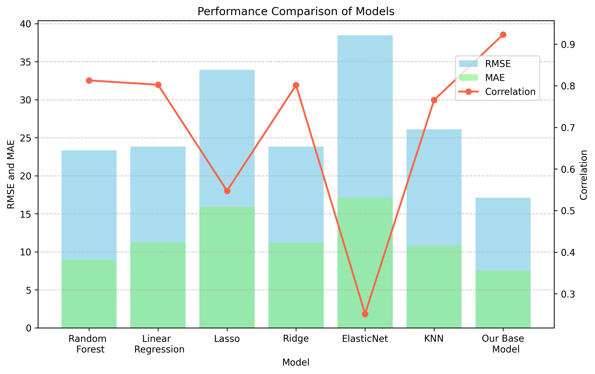
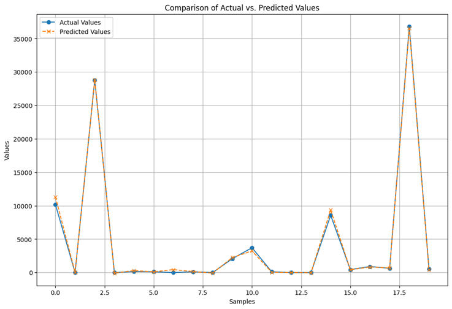

# INVENTORY MANAGEMENT MODEL

### INTRODUCTION 

The aim of this project is to develop an inventory management system using deep Learning approaches, highlighting the application of transfer learning. The central objective of this initiative is to set up a reference model that aims to optimize stock levels, thus avoiding product excesses or shortages, while minimizing the costs associated with storage and maximizing sales opportunities. To this end, we are developing a model capable of accurately predicting the specific demand for each product. Our model is designed to adapt quickly to company-specific data, exploiting the advantages of transfer learning.
By adopting this approach, companies can benefit from several significant advantages in managing their inventories:
1. Supply optimization: Optimal stock levels avoid costly overstocking, while maintaining sufficient quantities to meet customer demand.
2. Cost reduction: More accurate inventory management reduces the costs associated with holding stock and frequent replenishment.
3. Improved Customer Service: By avoiding stock-outs, companies can better meet customer demand, improving customer satisfaction and avoiding lost sales opportunities.
4. Strategic planning: Stock level forecasts help companies to plan their production, supplies and resources more strategically.
5. Anticipation of Market Trends: Enables companies to anticipate fluctuations in demand and adapt sales strategies more effectively.

#### OBJECTIVES 

-	Develop a demand forecasting model based on Deep Learning, which can be used as a starting point for optimizing company inventories. 
-	Use historical sales data, purchase price data, inventory levels and other variables to train the model. 
-	Implement transfer learning to enable companies to efficiently adapt the model to their specific data.

### PROJECT STRUCTURE

The project is organized as follows:

**project_root/**

|-- **checkpoint/**

| |-- base_model_checkpoint.h5 # Optimal weights for the basic model

| |-- transfert_learning_model_checkpoint.h5 # Optimal weights for transfer learning

|-- **data/**

| |-- 2017PurchasePricesDec.csv # Details of product purchase and sale prices

| |-- BegInvFinal1232016.csv # Inventory start date data by product and store

| |-- EndInvFinal1232016.csv # Inventory end date data by product and warehouse

| |-- InvoicePurchases12312016.csv # Invoice data

| |-- PurchasesFinal12312016.csv # Product purchase data by store, including quantity, price, and other relevant variables

|  |-- SalesFinal12312016.csv # Historical sales data


**| |-- prepocessing**      # folder containing the preprocessed data

**| |-- transfertLearning** # folder containing target company data for transfer learning

| |

|  **|-- notebooks/**

| |-- data_exploration.ipynb # Data exploration

| |-- data_preprocessing.ipynb # Data preprocessing

| |-- stock_management_model_development.ipynb # Design, hyperparameter search and training of stock management model

| |-- stock_management_model_evaluation.ipynb # Stock management model evaluation and comparison with reference models

| |-- reference_models_training.ipynb # Training and evaluation of reference models

| |-- transfert_learning.ipynb # Transfer Learning techniques for model adaptation

| |

**|-- src/**

| |-- data_preprocessing_utils.py # Tools for data preprocessing

| |-- model.py # Model architecture

| |-- utils.py # Practical tools

| |

**|-- README.md** # This README file

**|-- requirements.txt** # Project dependencies

### DEPENDENCIES INSTALLATION

To ensure that this project runs smoothly, it's important to have certain libraries installed on your system. These libraries provide the tools needed to run and work with our inventory management model based on Deep Learning and transfer learning.
Make sure that the following libraries are installed on your system:

o	Python (version 3.8): This is the central programming language for our project.

o	TensorFlow (version 2.4): This open-source library is used to implement machine learning and deep learning in our model.

o	Keras (version x.x): As a high-level interface, Keras simplifies the creation and training of deep learning models. It can rely on TensorFlow as a backend.

o	scikit-learn (version 1.3): This library is essential for machine learning, machine learning and data science tasks.

o	pandas (version 2.0): For data manipulation and analysis, pandas offers powerful features.

o	matplotlib (version 3.7): For graphical visualization of data and results, matplotlib is a must.

o	numpy (version 1.20): This library plays a crucial role in the numerical calculations required for our project.

These libraries fulfill specific roles and are essential at different stages of the project, from data preparation to results evaluation. Be sure to adjust versions according to your needs and the compatibility requirements of your project.
If you haven't already installed them, you can follow the instructions in the next section to set up a runtime environment with all project dependencies from scratch.

#### SETTING UP AND CONFIGURING THE ENVIRONMENT:

We're going to set up an isolated environment using Anaconda.
1. Installing Anaconda:
   To get started, download and install Anaconda from the official URL: https://www.anaconda.com/download
2. Setting up the environment:
   To set up an environment containing the libraries required by the project from the "requirements.txt" file, follow these steps:
-	On Windows, open the "Anaconda Prompt" terminal by searching for it among the applications. On Mac, access the terminal.
-	From the Anaconda terminal, make sure you're in the project's main directory.
-	Some libraries, such as numpy and optuna, are not available in the default channel. To remedy this, add additional channels with the command:
```console
$ conda config --add channels conda-forge
```
-	Then run the following command to create the environment while incorporating the libraries indicated in the "requirements.txt" file:  
```console
$ conda create -n name_of_your_environment --file requirements.txt
```
Once the environment has been successfully created, proceed to install TensorFlow by following the steps below:
-	Start by activating the environment with the command:
```console
$ conda activate environment_name
```
-	Then install TensorFlow using the following command:
```console
$ pip install tensorflow==2.4
```
-	Then install PrettyTable using the following command:
```console
$ pip install prettytable
```
-  You need ipykernel to run your notebook jupyter, run the following command to install ipykernel in your environment: 
```console
$ pip install ipykernel
```
-  Finally, to avoid package conflicts, update typing-extensions with the following command:
```console
$ pip install typing-extensions==3.7.4
```
Once you've followed these steps, the installation and configuration of your environment is complete.
3. Installing a text editor:
You will also need to install a text editor such as Visual Studio Code by following this link: https://code.visualstudio.com/
4. Using the Environment in Visual Studio Code:
-	Once Visual Studio Code is installed, open the project directory using the "File" > "Open Folder" option.
-	Open the project notebook files. Then select the environment you created earlier as "kernel" in the top left-hand corner, using the "Select Kernel" > "Python Environments" > "name_of_your_environment" option.
This will enable you to run the project notebooks in Visual Studio Code.
To speed up training phases, it is possible to take advantage of the graphics processing units (GPUs) present on compatible computers. If this is your case, instructions on how to install TensorFlow with GPU support are available at: https://neptune.ai/blog/installing-tensorflow-2-gpu-guide

### PART 1: BASE MODEL FORMATION

This first part introduces the procedure for forming the initial inventory management model using historical sales data, product purchase price data and other relevant variables. This initial model will serve as a starting point for the subsequent application of transfer learning.

The data used in this project comes from a large distribution company offering a wide range of products. The dataset includes sales records, inventory levels, supplier invoices and other relevant details. More information on the data is available in the structural section of the project. The company operates a total of 79 outlets and offers a wide range of over 6890 distinct products. Sales data cover a two-month period, documenting transactions in all 79 stores. In addition, the company manages a comprehensive inventory including raw materials, work-in-progress (WIP) and finished goods.

#### DATA PRE-PROCESSING

Before exploring the data, it is essential to perform preprocessing as follows:
- In the notebook `notebook/data_preprocessing.ipynb`, load data from CSV files and organize in appropriate data structures.
- Initially clean by processing missing values, eliminating any outliers and preparing data for subsequent analysis. Save pre-processed data in the `data/preprocessing/` directory.

#### DATA EXPLORATION

After preprocessing the data, the data exploration phase consists of:
- In the `data_exploration.ipynb` notebook, load the pre-processed data from the ‘data/preprocessing/` directory for exploratory analysis.
- Perform an analysis exploring time trends, sales and relationships between different variables. This step will help you gain an understanding of the intrinsic characteristics of the data..
- Creating Reference Models for Evaluation
Reference models have been developed to evaluate the performance of the model under development for inventory management. These reference models incorporate classic machine learning approaches:
   - Random Forest model
   - Linear Regression Model
   - Ridge
   - Lasso
   - ElasticNet
   - K-Nearest Neighbors Regression

These models have been trained using the same pre-processed data that will be used to build the inventory management model. The main objective is to create a clean inventory management model, and then compare its performance with that of the reference models.
For more details on the creation and evaluation of these reference models, see the notebook `reference_models_training.ipynb` in the `notebooks/` folder. This comparative step provides an informed overview of the model's performance compared with conventional machine learning models.

#### DESIGN, TRAINING AND OPTIMIZATION OF THE INVENTORY MANAGEMENT MODEL

Having explored the data and created the reference models, the next step is to design, train and optimize the inventory management model. This model is based on a MLP (Multilayer Perceptron) deep learning architecture.
The notebook `model_stock_management_development.ipynb`, located in the `notebooks/` folder, presents the steps involved in creating the model, including:
1. Data Preparation and Formatting: Load pre-processed data and format it to match the input format required by the model.
2. Basic Model Creation: Set up an initial model using default parameters. This initial model will serve as a starting point for subsequent optimization.
3. Hyperparameter optimization: Apply Bayesian optimization techniques to find the best hyperparameter combinations to maximize model performance.
4. Training with Best Hyperparameters: Use the hyperparameters identified in the optimization step to train the model.
5. Save trained parameters: After training is complete, save the optimized model parameters for future use.

#### EVALUATION OF THE INVENTORY MANAGEMENT MODEL

You can compare model performance in the `stock_management_model_evaluation.ipynb` notebook, located in the `notebooks` directory. The evaluation process involves loading optimized model weights, making predictions, and calculating error metrics. You can then compare these performance metrics with other models or previously created reference models.

| Model                   | RMSE    | Correlation | MAE     | RAE     | RRSE    | MAPE   | R2      |
|-------------------------|---------|-------------|---------|---------|---------|--------|---------|
| Random Forest           | 23.3435 | 0.812994    | 8.96228 | 0.504168| 0.58709 | 82.339 | 0.655325|
| Linear Regression       | 23.8307 | 0.802579    | 11.2327 | 0.631891| 0.599343| 218.499| 0.640788|
| Lasso                   | 33.9357 | 0.547551    | 15.9419 | 0.896799| 0.853486| 365.006| 0.271562|
| Ridge                   | 23.8388 | 0.801596    | 11.1452 | 0.626969| 0.599547| 214.896| 0.640543|
| ElasticNet              | 38.4939 | 0.251833    | 17.1119 | 0.962617| 0.968125| 397.283| 0.0627341|
| KNN                     | 26.1298 | 0.765809    | 10.7885 | 0.606903| 0.657167| 142.926| 0.568132|
| Stock Management Model | 17.1057 | 0.923358    | 7.52769 | 0.406239| 0.3849  | 120.014| 0.85185 |



In summary, the inventory management model performed well in the evaluation. Its low RMSE (Root Mean Squared Error) of 16.22 reinforces the idea that predictions tend to approximate actual values on average. A high correlation of 0.92 underlines a strong linear relationship between predictions and actual observations, highlighting the model's ability to accurately capture trends. A MAE (Mean Absolute Error) of 7.53 points to moderate individual errors, while a RAE (Relative Absolute Error) of 0.42 reveals a clear improvement over a naïve prediction. A RRSE (Relative Root Squared Error) of 0.41 and an R2 (Coefficient of Determination) of 0.83 reinforce the assertion that the model explains a significant proportion of the variance. Although MAPE (Mean Absolute Percentage Error) remains at 120%, overall performance remains robust. These results fully confirm the indisputable effectiveness of the inventory management model for forecasting and proactively managing inventory levels.

## PART 2: CASE STUDY WITH TRANSFER LEARNING

### INTRODUCTION

Transfer learning is a powerful machine learning technique that enables the knowledge and skills acquired from training a model to be applied to a new and different task. In the context of our inventory management project, learning transfer is of crucial importance, as it enables us to adapt our basic model to specific business requirements, reduce costs and improve forecast accuracy. 

#### Objective:
This section looks in detail at learning transfer as part of our inventory management project. We focus on a specific use case to demonstrate the ability of our basic model to adapt precisely to particular requirements, using the Favorita company as a case study. This crucial phase of the project illustrates how the knowledge acquired can be applied in a real-life environment, while allowing the model to be customized to optimize Favorita's specific stock levels and sales forecasts. In this section, we will follow a precise sequence of actions: loading the basic model, creating a customized version for Favorita, re-training the model and generating customized forecasts for this company. Using Favorita as a concrete example, we'll demonstrate how learning transfer offers considerable flexibility in adapting the model to the distinctive characteristics of any company.

### COMPANY DATA

In this case study, we focus on demand prediction for thousands of product families sold in Favorita stores, located in Ecuador. The training data is very detailed, and includes information such as dates, store characteristics, product attributes, the presence of promotions for each item, as well as numerical sales data. Supplementary files provide additional information that can prove invaluable in the process of creating predictive models. You can find the data in the "data/transferLearning" directory.

### MODEL ADAPTATION AND TRAINING

This section will show how the basic model can be customized and trained to meet Favorita's specific needs.

1. Data loading and pre-processing
In the notebook `notebook/transfer_learning.ipynb`, Favorita's raw data is loaded and subjected to rigorous pre-processing. This pre-processing includes cleaning the data, eliminating outliers, and organizing the data so that it corresponds to the requirements of the basic model.

2. Separation of training and test data
After initial pre-processing, the data is divided into two distinct sets: training data and test data. The training data will be used to fine-tune the model, while the test data will be used to evaluate its performance specifically for Favorita. This division is crucial to ensure accurate evaluation of the model in the context of the company.
3. Creating a customized model for Favorita
Every company, including Favorita, has its own particularities when it comes to inventory management. To adapt to these particularities, a Favorita-specific template is created, based on the previously trained basic template. This step involves specific adjustments to meet Favorita's unique needs.
These adjustments may include adding additional layers to the base model, modifying existing parameters, or incorporating company-specific features. The aim is to ensure that the model accurately reflects Favorita's needs and characteristics, while capitalizing on the knowledge previously acquired by the base model.
This process of adaptation and training ensures that the inventory management model becomes a tailor-made solution for Favorita, optimizing its inventory management operations accurately and efficiently.

### RESULTS

The results of the evaluation of our inventory management model are extremely promising. The correlation between model predictions and actual values reaches an impressive 0.988, indicating a strong linear relationship between the two. What's more, the Mean Absolute Error (MAE) is 860.05, meaning that our predictions have a relatively low mean absolute error in terms of raw values. The Relative Absolute Error (RAE) is also remarkably low at 0.0565, suggesting that our model has considerable accuracy when predicting stock levels.
The Root Mean Squared Error (RMSE) stands at 4,805.80, reflecting the overall accuracy of our model in terms of deviation from actual values. The Relative Root Squared Error (RRSE) at 0.1524 is also a positive indicator, confirming the ability of our model to explain a large proportion of the variance in the data.
Finally, the Coefficient of Determination (R2) reached a significant value of 0.9767. This means that our model effectively explains the variability in the data, demonstrating its ability to provide relevant and useful forecasts for inventory management. 
The following figure provides a visual overview of actual versus predicted values, clearly illustrating the model's ability to accurately anticipate future product demand.
 


### TO GO FURTHER

Now that the inventory management model is firmly trained and evaluated, it's time to explore the many possibilities it offers for optimizing your business. Here are a few ways to go further:
#### API integration:
You can integrate the model directly into your existing systems by transforming it into an API (Application Programming Interface). This will enable you to take advantage of its real-time demand forecasting capabilities. For example, you could use this API to automatically adjust your stock levels based on demand forecasts, or to recommend specific orders based on analysis of past trends.
#### Web interface development with Flask:
For user-friendly interaction with the model, consider developing a web interface using Flask, a Python micro-framework. Such an interface would allow your team members to easily enter parameters and get inventory management forecasts in return. This could greatly simplify order planning, resource management and optimization of your supply chain.
#### Customization for your business:
Every business has its own specific characteristics and needs. The basic model can be customized to meet these unique requirements. You can add additional layers of neurons, tailor inputs and outputs to reflect the specifics of your business, and further refine model parameters to improve forecast accuracy.
Integration of other Data Sources:
Enrich your forecasts further by integrating other data sources you deem relevant, such as weather data or seasonal events. This will enable the model to take into account a wider range of factors influencing demand, thus improving the quality of its forecasts.
#### Ongoing training:
Don't forget that the quality of your forecasts depends to a large extent on the quality of your data and the model's ability to adapt to changes in the market. Plan a continuous training process to keep the model up to date, periodically reassessing performance and adjusting parameters as necessary.

### License
This project is licensed under the GNU General Public License v3.0 License - see the [LICENSE](LICENSE.txt) file for details

